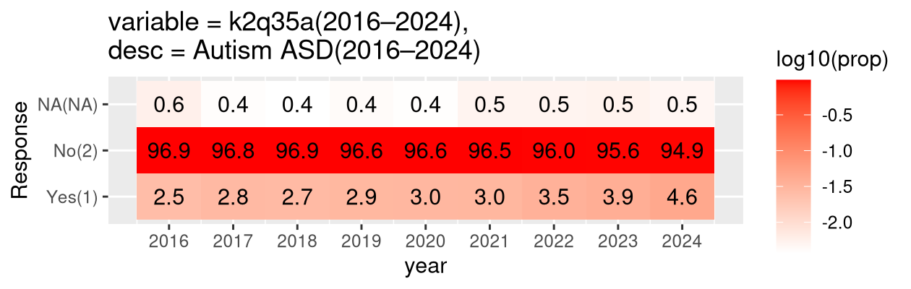
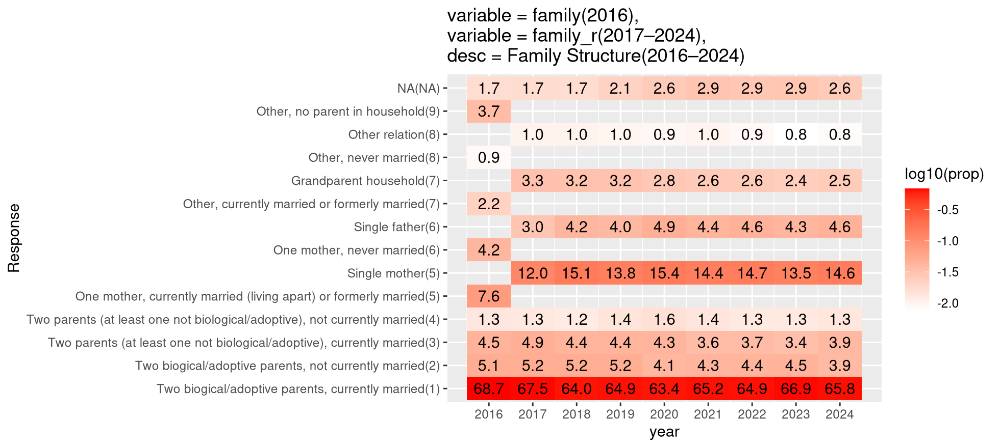
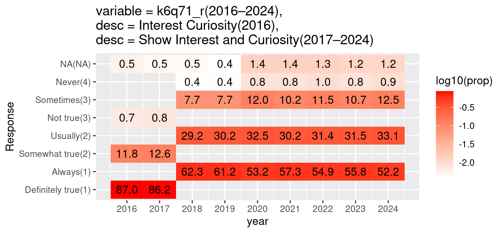

# nsch-ml-paper

Interpretable machine learning analyses of NSCH data.

## 8 Feb 2026

<NSCH_data.R> downloads data from NSCH web site.
After running this script, you should have
- `NSCH_data/00_original_Stata/` original Stata data files)
- `NSCH_data/01_original_csv/` converted to CSV
- `NSCH_data/01_original_sizes.csv` meta data for each file (number of rows and columns).

<figure-heatmap-response-prop-over-years.R> creates heat maps for checking consistency of response proportions across years, inspired by [my previous analysis of Vince’s data](https://github.com/tdhock/2024-01-ml-for-autism/tree/main?tab=readme-ov-file#10-oct-2024).

The figure above shows that the Autism response proportions are consistent across years.

The figure above shows that the Family Structure response choices changed in 2017.

The figure above shows that the Family Structure response choices changed in 2018.
After combining the years, we should re-run this analysis to confirm consistency across years, for these variables, and others.

## Related work

* https://github.com/tdhock/2024-01-ml-for-autism
* https://github.com/NAU-ASD3/nsch
* https://github.com/vas235/ASD3-machine-learning-prep
